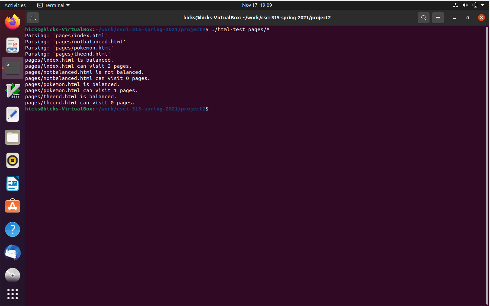
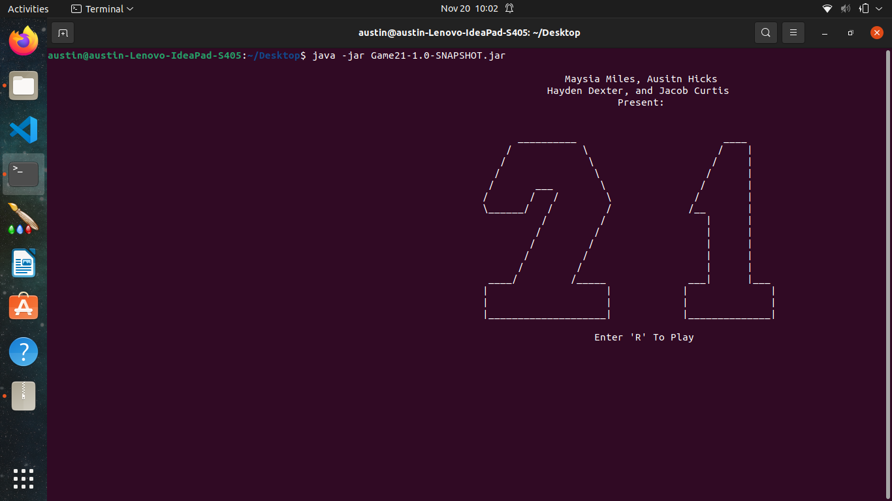
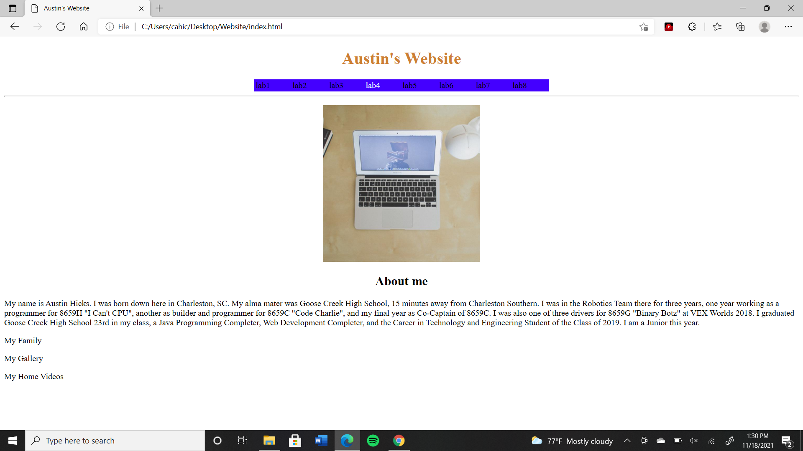

Portfolio
=========

Programming Projects
--------------------

*For access to my private project repositories, please [email me](mailto:example@csustudent.net?subject=GitHub%20Access) with the subject line, GitHub Access.

---
### [TAL Database in APEX | CSCI 419](project1)

---
### [HTML Parsing Project | CSCI 315](project2)

---
### [Game 21 Group Project | CSCI 325](project3)

---
### [Lab 4 - External CSS | CSCI 332](project4)

---

Ethics Papers
-------------

### [Ad-Blocking and Its Effects](/pdf/Ad-Blocking.pdf)

-   **Class: CSCI 235 Procedural Programming**  
-   **Grade: B**

### [Certification and Medical Equipment](/pdf/Certification.pdf)

-   **Class: CSCI 315 Data Structures** 
-   **Grade: A**

### [Programs, Patents, and Protection](/pdf/Protection.pdf)

-   **Class: CSCI 332 Applied Networking** 
-   **Grade: B**

---

Presentations
-------------

### [Blackjack/Game 21 Presentation](/video/Game21_Presentation.mp4)

- **Class: CSCI 325 Object-Oriented Programming** 
- **Grade: B**

### [Lab 3 Walkthrough Presentation](/video/Lab3_Presentation.mp4)

- **Class: CSCI 332 Applied Networking** 
- **Grade: A**

---

Page template forked from <a href="https://github.com/csu-cs/csci-portfolio">CSU-CS</a>

<!-- Remove above link if you don't want to attributive -->
