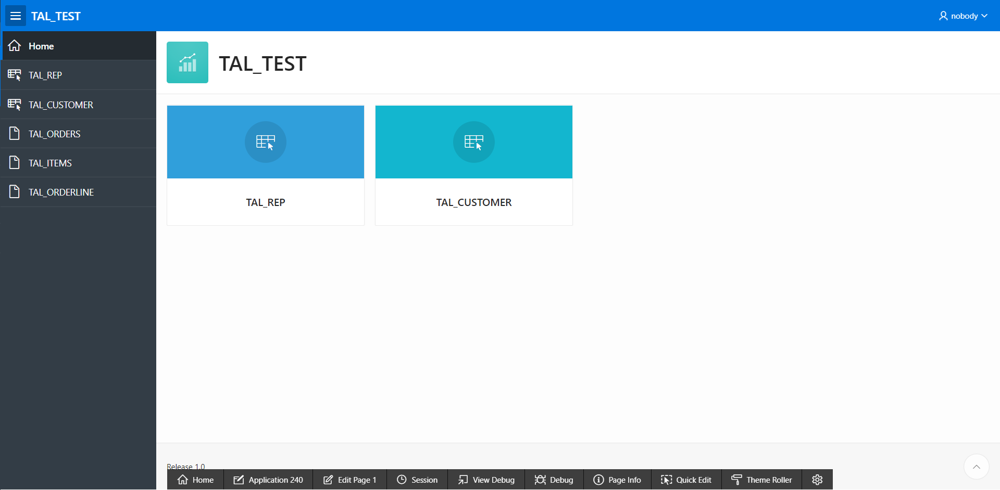
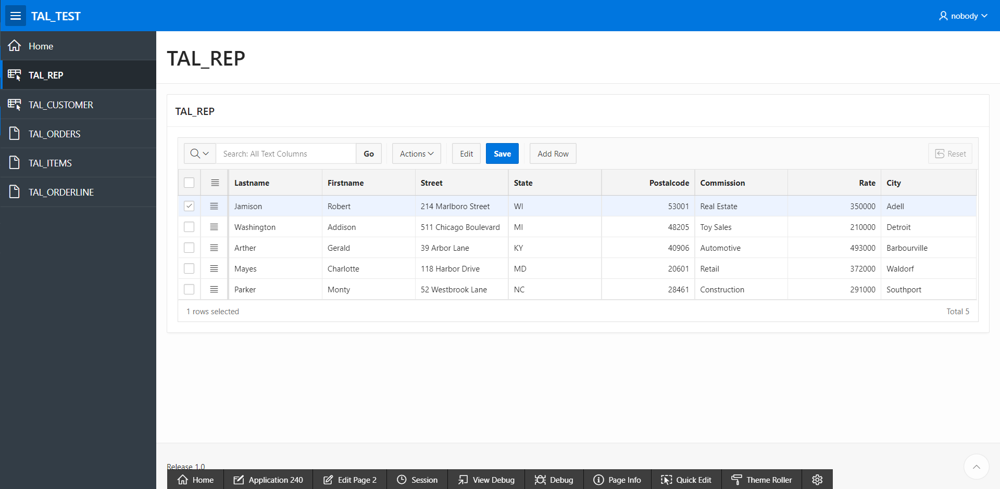
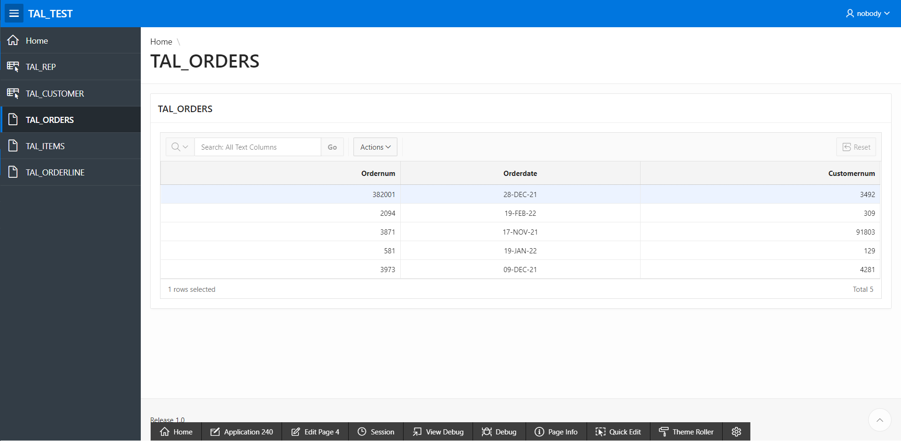

[Back to Portfolio](./)

TAL Database in APEX
===============

-   **Class: CSCI 419 Database Management** 
-   **Grade: A**
-   **Language(s): SQL**
-   **Source Code Repository:** [cAustinHicks/tal_database](https://github.com/cAustinHicks/tal_database)  
    (Please [email me](mailto:cahicks@csustudent.net?subject=GitHub%20Access) to request access.)

## Project description

For this assignment, we were to learn how to create tables and applications using the Oracle Application Express (APEX) website. 

## How to compiles / run the program

Download f240.sql from the repository linked above and import the application to your database management system (Oracle APEX is recommended).

You can possibly open up the application through the link stored in the repository's text file. If you do this, however, I strongly encourage that you do not edit any information that exists within the application's tables.

## UI Design

When opening the TAL Application using a database management system like APEX, you will be brought up to this home screen (see Fig 1.). From here, you can navigate to the information that is stored within the tables by clicking on the bubbles in the home screen or by using the menu bar along the left-hand side. For TAL_REP (see Fig 2.) and TAL_CUSTOMER (see Fig 3.), there are lists of data stored in tables providing names, addresses, the identification numbers of both customers and representatives, the rate and commission type of the representative, and the balance and credit limit of the customer. These can be edited directly in the application.

Note: Any names, streets, or companies used in filling out these tables were made up and any correlation with them that happen to be true is coincidental and accidental.

For the other tables such as TAL_ORDERS (see Fig 4.), they provide information in a table as well; however, you are unable to manipulate the information for these tables directly in the application.

Fig 1. The application's home screen.

Fig 2. TAL_REP table in the application.

Fig 3. TAL_CUSTOMER table in the application.

Fig 4. TAL_ORDERS table in the application.

## 3. Additional Considerations

Once again, if you are to use the website link to visit this application, I strongly encourage you to not edit any information in the tables. This data is strictly for presentation and any inapproriate or personal information added or altered in this database is discouraged. If such information is added, I will not take responsibility for their inclusion. I will only be responsible for what is in the screenshots above.

[Back to Portfolio](./)
