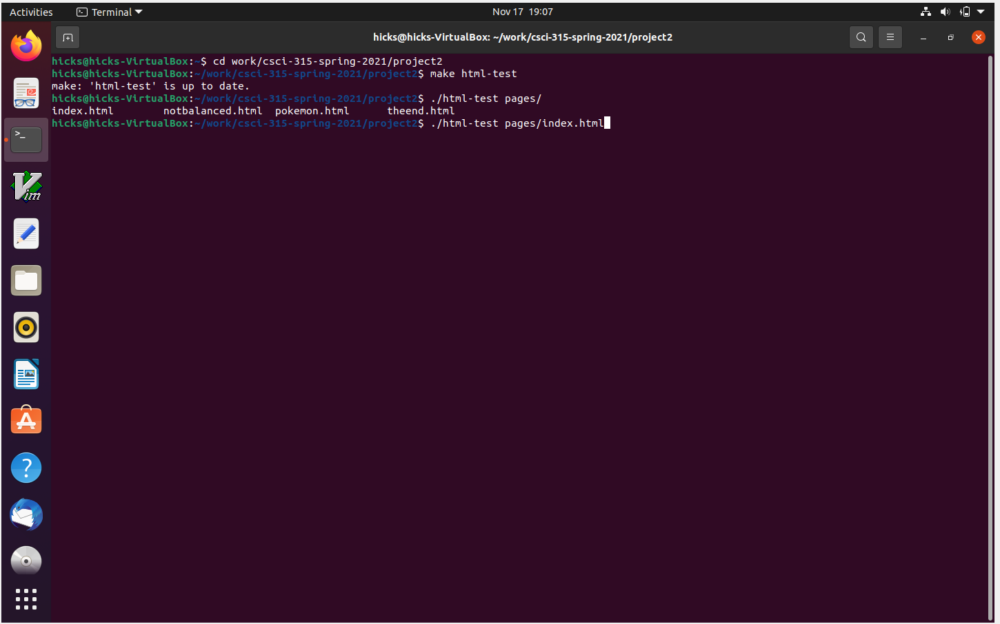
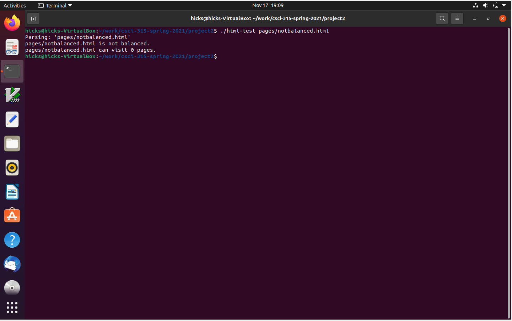
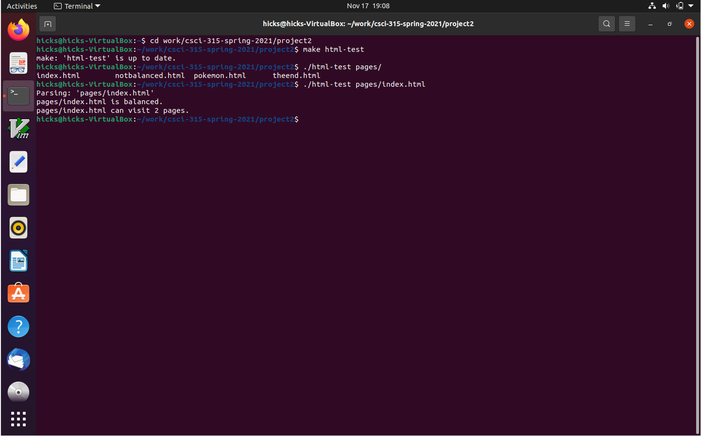

[Back to Portfolio](./)

HTML Parsing Project
===============

-   **Class: CSCI 315 Data Structures** 
-   **Grade: A**
-   **Language(s): C++**
-   **Source Code Repository:** [cAustinHicks/html-parser](https://github.com/cAustinHicks/html-parser)  
    (Please [email me](mailto:cahicks@csustudent.net?subject=GitHub%20Access) to request access.)

## Project description

Using C++, we were to create a program in order to test the parsing of website tags. Opening tags in the HTML documents tested are saved into a string array to save the order of each tag that has been found. If the next closing tag that shows up in the document does not match the opening tag at the end of the array, then the HTML file is unbalanced. If the HTML file is balanced, the program looks for any anchor tags and counts them, then it repeats the process for all connecting files. If the HTML is unbalanced, any anchor tags within that file are ignored. At the end of the program, it prints out the name of the HTML file, tells you if it is balanced, and tells you how many pages it can visit. 

## How to compiles / run the program

Download the files that were given to you, then go to Command Prompt/Terminal and type these out:

```cd [folder you put the project in]
make html-test
./html-test pages/*
```
You can replace ```html-test``` with any file name you want to try, however html-test will already be available to download. If you do choose to make a new file, remember to make ```./html-test``` be ```./[your file name]```
You can also replace ```pages/*``` with the directory and file you want to test as well. To test all HTML files in that directory, use the asterisk.

## UI Design

Because this program is used in a terminal and there is only one command that is used for the process (see Fig 1.), there is no detailed UI design for this project. Upon submitting the command, the string of information will be printed out in the terminal, showing you which files have been tested. Each HTML file will show whether they are unbalanced (Fig 2.) or balanced (Fig 3.) and how many pages they can visit. Depending on what you run for your command, you can check the parsing of more than one file (see Fig 4.)


Fig 1. Example of using the makefile and syntax for testing.


Fig 2. Example of an unbalanced HTML file's response.


Fig 3. Example of a balanced HTML file's response.


Fig 3. Example of parsing more than one HTML file.

## 3. Additional Considerations

This program was not designed for testing the parsing and page visiting on menu-based website groups. This means if a website were to visit a website already counted, the program will be stuck on an infinite loop and will have to be closed down.

[Back to Portfolio](./)
