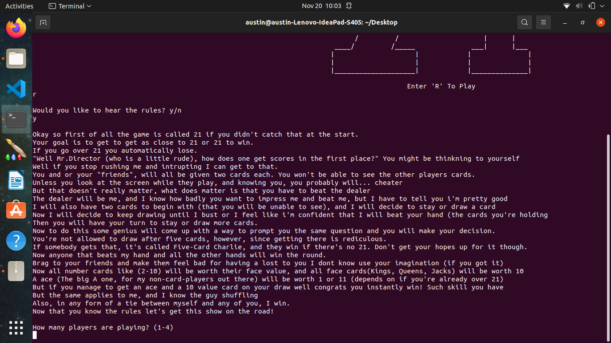
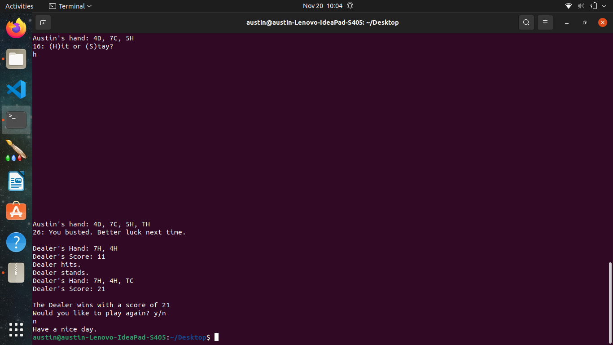

[Back to Portfolio](./)

Game 21 Group Project
===============

-   **Class: CSCI 325 Object-Oriented Programming** 
-   **Grade: A**
-   **Language(s): Java**
-   **Source Code Repository:** [cAustinHicks/game21](https://github.com/cAustinHicks/game21)  
    (Please [email me](mailto:cahicks@csustudent.net?subject=GitHub%20Access) to request access.)

## Project description
As a group project, a team consistent of myself, Jacob Curtis, Hayden Dexter and Maysia Miles were to decide on a game to implement into a Java program. Our decision was to make a classic card game known as Blackjack or 21. The object of the game was simple:

Each player (up to four) and the dealer (CPU) will all start off with a total of two cards that were randomly dealt from the deck.
One by one, each player will play out their turn, choosing to hit or stay after seeing their current score and what cards they have.
Either by having 5 cards (a rule known as 5-Card Charlie), 21, busting, or choosing to stay, the player ends their turn and it moves on to the next player.
After all players have played, the Dealer plays, choosing to hit if under 16 and staying if at or over 16.

## How to compiles / run the program

This program was designed to be used on Apache NetBeans IDE.
You will need to download all files in order to run the project

Upon opening NetBeans, click on "Open Project" and select Game21.
Open up the csu.csci325 source package and open Game21.java.
Now click on "Run Program" to run the program.

## UI Design

The program is a single-line command program. 

The process begins by printing out the title screen (see Fig 1) and waiting on the player to input the letter 'R' to continue. If the user enters another character instead, the program will exit out to prevent errors. Upon choosing to continue, the user will be prompted if they want to read the rules (see Fig 2). They must enter either 'y' or 'n' to continue. From there, the user can enter how many people are playing (an integer between and including 1 and 4) followed by the names of each player. Afterwards, the game begins, allowing players to choose between hitting and staying by choosing either 'h' or 's' (see Fig 3). If the player busts, has 21, or has 5 cards, their turn ends without them choosing to stay.

After all players have finished, the dealer (CPU) will play itself, choosing to hit under 16 and to stay at any other point (see Fig 4). After its turn, the program determins who wins by first deciding out of the players who had the better hand, either by having 5 cards, not busting, having the highest score, or by having 21. Afterwards, it compares the best hand of the players to the dealer's. If there is any tie between the dealer and the player, the dealer having 5 cards, or if all players busts, the dealer wins. Otherwise, the player with the best hand wins.

Fig 1. The title screen

Fig 2. Example output of the rules along with the player number prompt.

Fig 3. Demonstration of the hit command.

Fig 4. Demonstration of a player busting along with the Dealer's system and closing the game.

## 3. Additional Considerations

The 5-Card Charlie rule was a process that could have been left out for the sake of simplicity. At first thought of running with it, I had considered, as the programmer of the Cards and Game21 classes, that it would add extra depth to the program. However, the process itself will still need to be debugged for it to run smoothly during the comparison phase.

[Back to Portfolio](./)
