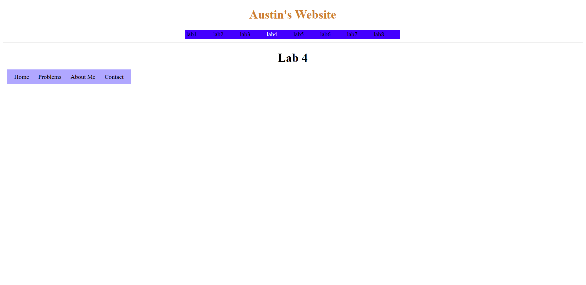
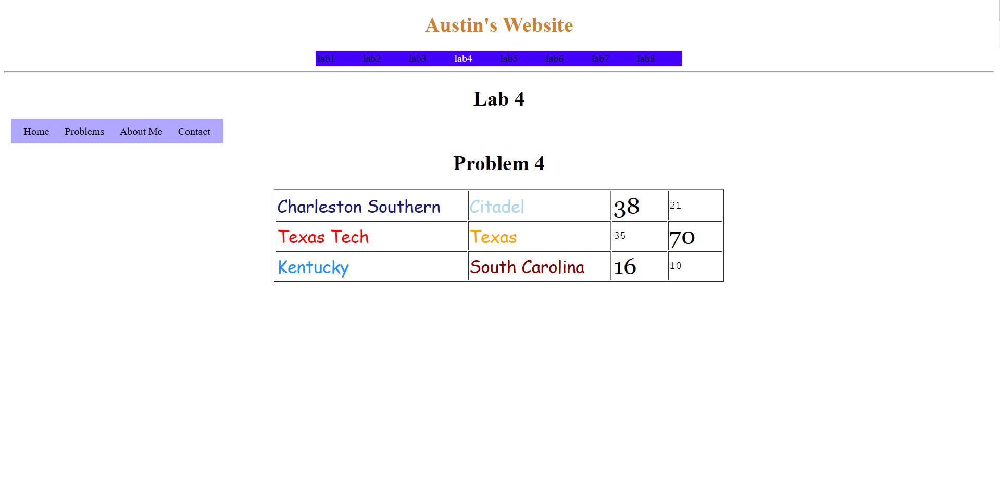

[Back to Portfolio](./)

Lab 4 - External CSS
===============

-   **Class: CSCI 332 Applied Networking** 
-   **Grade: A**
-   **Language(s): HTML and CSS**
-   **Source Code Repository:** [cAustinHicks/css_lab4](https://github.com/cAustinHicks/css_lab4)  
    (Please [email me](mailto:cahicks@csustudent.net?subject=GitHub%20Access) to request access.)

## Project description

For this project, we were asked to create a group of websites to show how to use CSS. For problem 2, we were to create the menu for the lab with a drop-down menu for each problem. Problem 3 was to change the background color of the table in an alternating grey-white style with the table header being black with white text. Problem 4 contained college football scores where the winning score is larger in font size than the losing score and the college names were colored with their team color. Problem 5 was changing the background color of ordered lists along with changing the organized symbols for each nested ordered list.

## How to compiles / run the program

Download the files provided and open the index.html file using any browser you prefer.
You can also use Visual Studio's LiveServer extension to open the document in a server.

## UI Design

Upon opening up the index.html file outside of the Lab 4 Folder, you will be greeted to an "About Me" page with a menu at the top of the screen (see Fig 1.). By clicking "lab4" in that screen, you will be taken to the Lab 4 index.html (see Fig 2.). From here, you can see a new menu bar with a drop down for "Problems." The tab "Home" will lead you back to this site while "About Me" will lead you to the home page prior. 

By clicking an item in the Problems drop down menu, you can view each of the 4 problems labeled Problem 2 to Problem 5. Problem 2 is the same as the home page but with a header called Problem 2. Problem 3 will show a new table titled "Weight Watching Calorie Records" followed by information for three different meals. Problem 4 will have a table showing real scores from college football games during this Fall, with each team name having their team color and the score of the winning team being largest (see Fig 3.). Problem 5 will have lists of car makes and models based on their general classification, with the background color for each classification being different and the ordering of the list having different symbols.

Lastly, there is a Contacts tab that will lead you to a website that provides my school email and a fake phone number. I advise that you do not try and call this number regardless.

Fig 1. My website's home screen

Fig 2. The Lab 4 home screen

Fig 3. Problem 4 website

Fig 4. Problem 5 website

## 3. Additional Considerations

For the sake of keeping the files needed to download from GitHub to a minimum, only the main webpage and the webpages of Lab 4 will be accessible. If you wish to see the other labs and websites, please contact me using the email above. Depending on the computer and browser, the drop-down menu may be off its designated position by a few pixels.

I am uncertain why, but reviewing the contents of Lab 4, I saw that the table for the top menu changed to match the table settings in the problem for Problem 3.

[Back to Portfolio](./)
