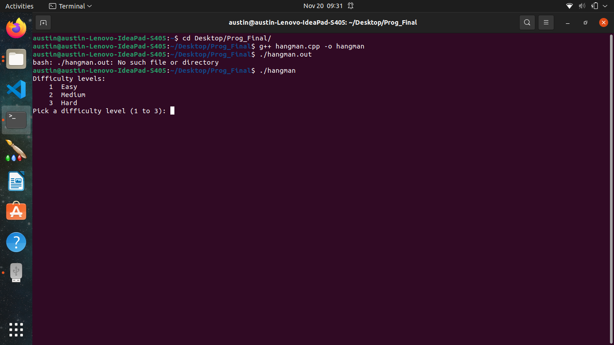
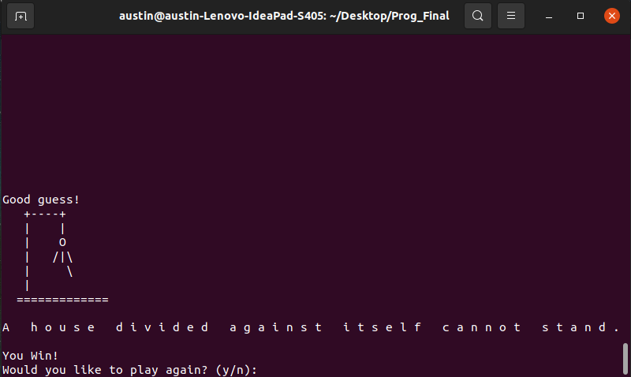
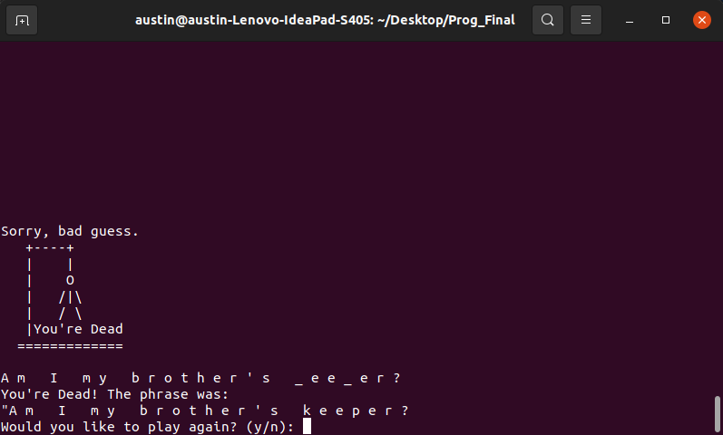

[Back to Portfolio](./)

Hangman
===============

-   **Class: CSCI 235 Procedural Programming** 
-   **Grade: A**
-   **Language(s): C++**
-   **Source Code Repository:** [cAustinHicks/hangman](https://github.com/cAustinHicks/hangman)  
    (Please [email me](mailto:cahicks@csustudent.net?subject=GitHub%20Access) to request access.)

## Project description

For this project, we were given the code of the gallows already programmed by our professor along with phrases that we will need. Our task was to provide the code in order for the game of Hangman to be played using these phrases we were given. Our program divides the phrases into three categories called easy, medium, and hard difficulties. After selecting these categories, the game randomly select the phrase for the player to guess. The player will then guess each letter until they are able to find the phrase or until the man is completely drawn in the gallows. The player will lose after guessing the letters incorrectly five (5) times, printing out the phrase on the screen. After the game, the player can decide to keep playing in that difficulty until all phrases are used or they can exit out.

## How to compiles / run the program

To compile and run the program, type this command in the terminal:

```g++ hangman.cpp -o hangman```

You can replace ```hangman``` with any name that you choose.
For Windows, double-click the hangman.exe file to run it.

If compiled with a Linux terminal, run the file like this:
```./hangman```

## UI Design

This is a command-line program. Upon starting the program, the game will prompt for the user to select a difficulty by entering the number beside it (see Fig 1.). If the player does not enter any of those numbers, the program will repeat the prompt until selected. From there, the empty gallows will be printed along with a string of underscores, showing the player how long the phrase is. They will have to choose a letter in order to guess if they are in the phrase. If they are not, they will show up in a "missed letters" row underneath the phrase and a part of the stick man will be drawn in the gallows. If it is, it will show up in the places it appears in the phrase. Upon winning, the gallows will print out the current state, the full phrase, and print "You Win!" at the bottom (see Fig 2.). However, guessing incorrectly five (5) times will cause the gallows with the full man to print, how far you were with the phrase, and the full phrase underneath it (see Fig 3.). After the end of that game, the program will ask if you wish to continue, where selecting 'y' prints out a new phrase to guess and selecting 'n' exits the program. 


Fig 1. Opening the game, prompting for difficulty


Fig 2. Example of completing the phrase and winnin the game.


Fig 3. Example of losing and the completed gallows.

## 3. Additional Considerations

Running the file on Windows has been problematic for me, as I have not run this in two years as of writing this markdown file. It provided errors regarding a missing libstdc++-6 and libgcc_s_dw2 DLL files. After adding them, however, it gave another error about an unusually named procedure entry point not being located. I highly recommend running on Linux via Virtual Machine; however, it could be my computer alone that has been having the problems.


[Back to Portfolio](./)
