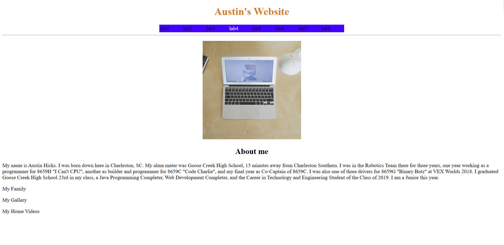
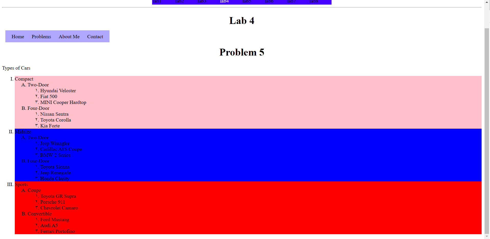

[Back to Portfolio](./)

Hangman
===============

-   **Class: CSCI 235 Procedural Programming** 
-   **Grade: A**
-   **Language(s): C++**
-   **Source Code Repository:** [cAustinHicks/hangman](https://github.com/cAustinHicks/hangman)  
    (Please [email me](mailto:cahicks@csustudent.net?subject=GitHub%20Access) to request access.)

## Project description

For this project, we were given the code of the gallows already programmed by our professor along with phrases that we will need. Our task was to provide the code in order for the game of Hangman to be played using these phrases we were given. Our program divides the phrases into three categories called easy, medium, and hard difficulties.

## How to compiles / run the program

To compile and run the program, type this command in the terminal:

```g++ hangman.cpp -o Hangman```

You can replace ```Hangman``` with any name that you choose.
Double-click the executable file in order to run the game.

## UI Design



Fig 1. My website's home screen


Fig 2. The Lab 4 home screen


Fig 3. Problem 4 website


Fig 4. Problem 5 website

## 3. Additional Considerations


[Back to Portfolio](./)
